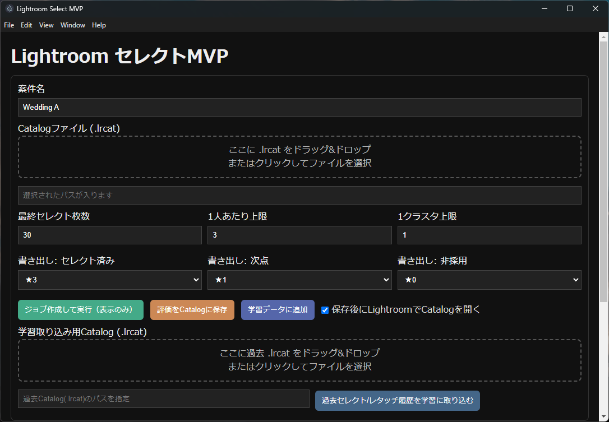

# PhotoAI



PhotoAI は Lightroom カタログをもとに、写真セレクトと学習データ蓄積を行うプロジェクトです。

## Features
- Lightroom Catalog (`.lrcat`) の読み込み（D&D / ファイル選択）
- 自動セレクト（★3=採用 / ★1=次点 / ★0=非採用の内部運用）
- セレクト結果の手動調整
- Catalog への書き戻し（書き出しマッピングはカスタム可能）
- 過去セレクト履歴の学習取り込み
- 学習イベントの暗号化保存（AES-256-GCM）

## Architecture
- Frontend: Electron
- Backend: FastAPI

## Security / Privacy
- RAW/JPEG など元画像データの保管・同梱を前提としない運用
- 学習イベントは `backend/learning_data/learning_events.enc` に暗号化保存
- 復号キーは環境変数 `PHOTOAI_LEARNING_KEY` で管理

## 必要ツール
- Git
- Python 3.12+（推奨 3.12 / 3.13）
- Node.js 20+
- npm

## Quick Start (Windows)
```powershell
# Backend
cd lightroom-auto-system\select-mvp\backend
python -m venv .venv
.\.venv\Scripts\activate
pip install -r requirements.txt
$env:PHOTOAI_LEARNING_KEY="<base64-32byte-key>"
python -m uvicorn app.main:app --reload --port 8008
```

別ターミナル:
```powershell
# Frontend
cd lightroom-auto-system\select-mvp\frontend
npm install
npm run dev
```

## Quick Start (macOS)
```bash
# Backend
cd lightroom-auto-system/select-mvp/backend
python3 -m venv .venv
source .venv/bin/activate
pip install -r requirements.txt
export PHOTOAI_LEARNING_KEY="<base64-32byte-key>"
python -m uvicorn app.main:app --reload --port 8008
```

別ターミナル:
```bash
# Frontend
cd lightroom-auto-system/select-mvp/frontend
npm install
npm run dev
```

## Notes
- ヘルスチェック: `http://localhost:8008/health`
- 詳細仕様: `lightroom-auto-system/select-mvp/README.md`
